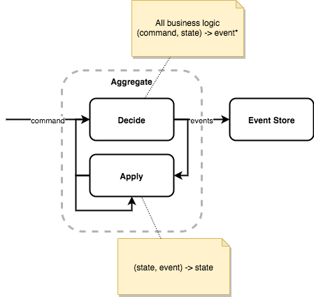

# Event sourcing example

## Use case
A business has to manage **interventions**.

For each intervention, it is possible to create some **reminders**.
* A reminder is scheduled at a given time.
* A reminder can be assigned to a country and to a person.
* A reminder has a status in a lifecycle.

## Event sourcing

[Event Sourcing](https://martinfowler.com/eaaDev/EventSourcing.html) is an architectural approach, which consists of keeping track not of the current state, but of the entire sequence of state transitions (Events) which led to it.
Events are the "source of truth" of the system, from which the current state (or any past state) is inferred.

The aggregate contains 2 types of functions:
* The **decide** function basically consists in deciding which events need to be created following a command. This is where all the business logic of the aggregate is located.
  * Input: command + former state
  * Output: event(s)
* The **apply** function consists in updating the state of the aggregate from an event.
  * Input: event + former state
  * Output: updated state
